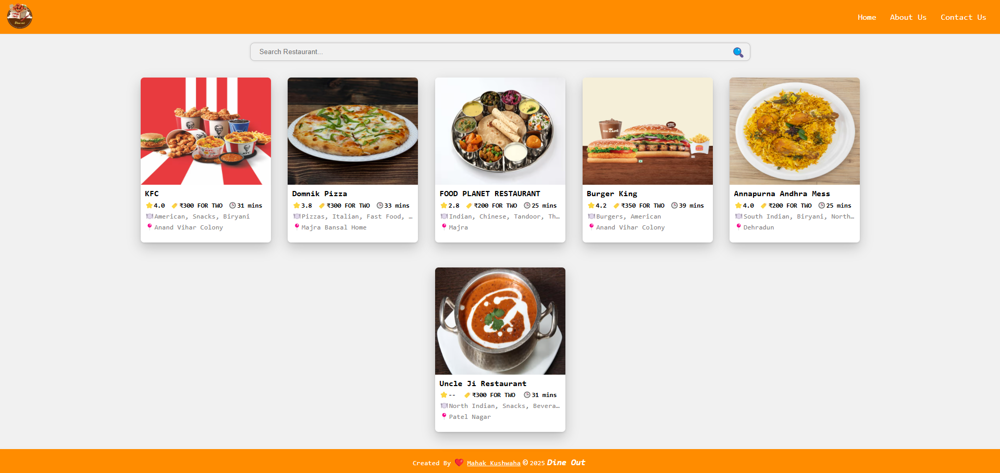

**Dine Out** is a food app UI frontend that displays a list of restaurants with details like ratings, cuisines, and cost. It features components like **Header, Body, RestaurantCard, SearchBox, RestaurantMenu, and Footer** for a seamless user experience.

### [_Live Link of Dine Out Food App Project_ 🍽️🚀](https://dine-out-fe.netlify.app/)

